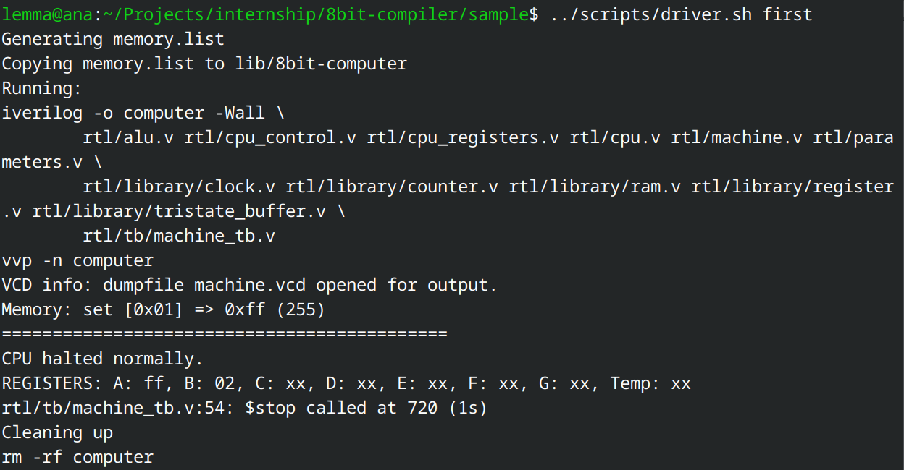

## 8bit-compiler

8bit-compiler for [8bit-computer](https://github.com/lightcode/8bit-computer) architecture.

It does some minor semantic checking and the codegen works directly on the AST.

```
.
├── CMakeLists.txt
├── include    // Code for all the interfaces as well as the ast implementation
├── lib        // External Library - Used uT for testing
├── README.md
├── sample     // Language sample
├── src        // Implementation files for the interfaces.
└── tests      // Unit and functionality (integration) testing.

```

## Usage:

```bash
Usage: ./etbit <filename> --show-parsed
```

filename can be anything and extension will be `.simpl`.

You can then use the generated `.asm` file with the assembler provided in the original 8bit-computer project to further run it on the VM.
 
 
Alternatively,

There is a driver provided as `scripts/driver.sh`. To use it, create a simple lang (save it as `filename.simpl` program in the `scripts` directory (or any other) and call the script (make sure to call it from the `scripts/` directory only) by giving it executable permissions.

Note: The 8bit-computer project uses python2, luckily to switch to python3 is easy by replacing the call to `print` on the last line with `print(...)` (i.e add the braces).

```bash
chmod u+x driver.sh

./driver.sh <filename_without_extension>
```

This would produce the `.asm` file in the same directory as well as put a `memory.list` file in the `out` directory in project root. 

The script also copies the `memory.list` file to the 8bit-computer submodule and runs the VM.

## Building:

```bash
# In 8bit-compiler directory
cmake . -Bbuild && make
```

## Sample outputs

Program:

```c
int a;
a = 1 - 2;
```

ASM:

```asm
.text

ldi A 1
ldi B 2
sub
sta 1


hlt
```

Computer Running with correct ROM:




